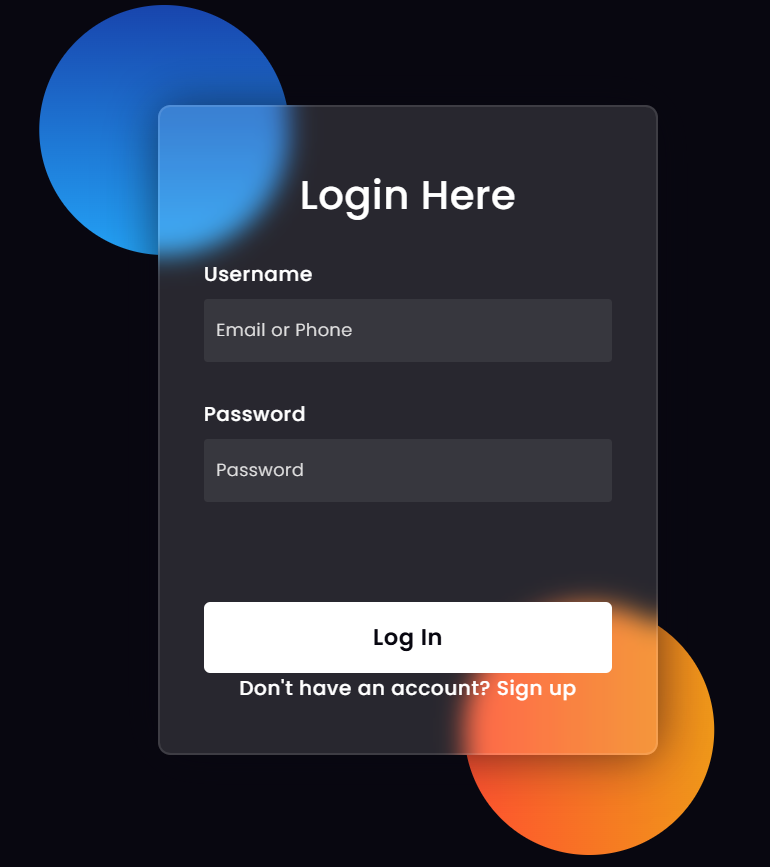
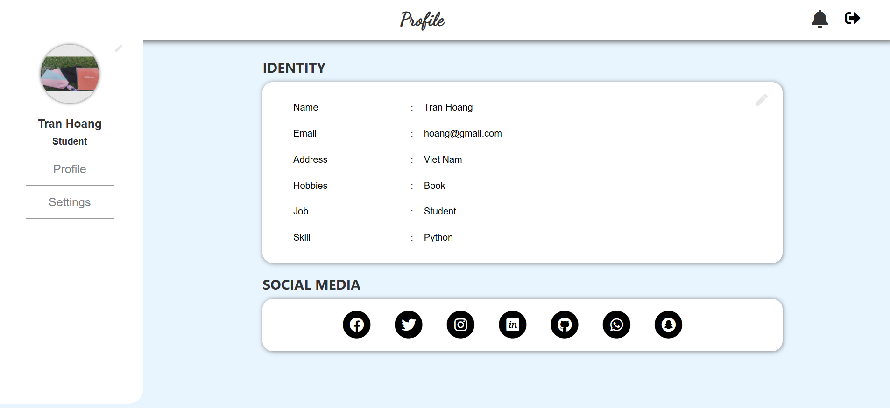
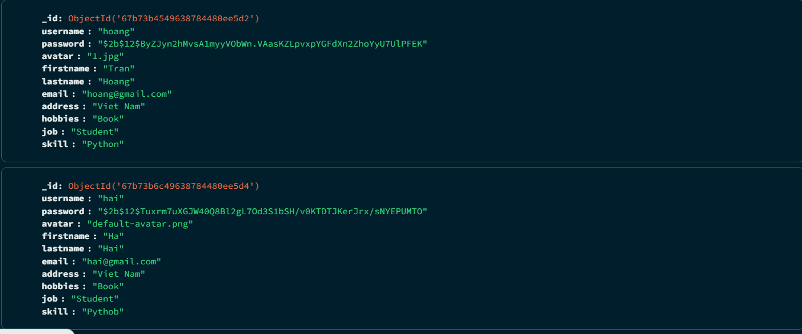
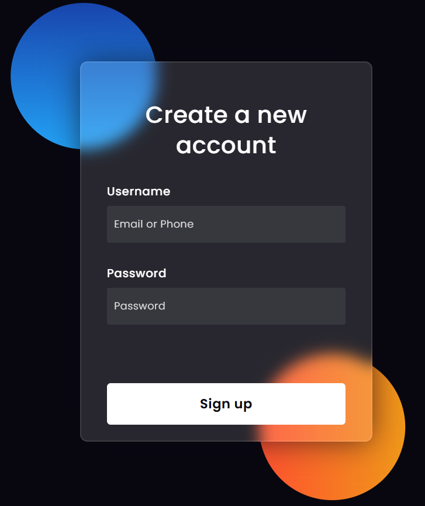
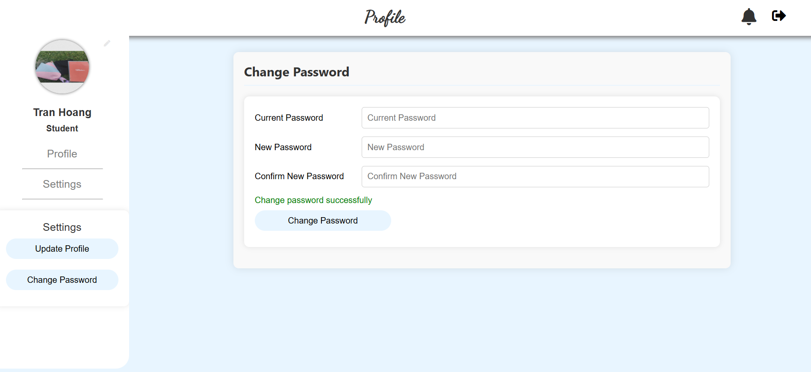
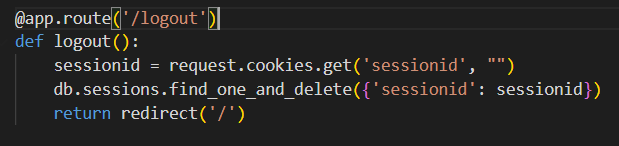
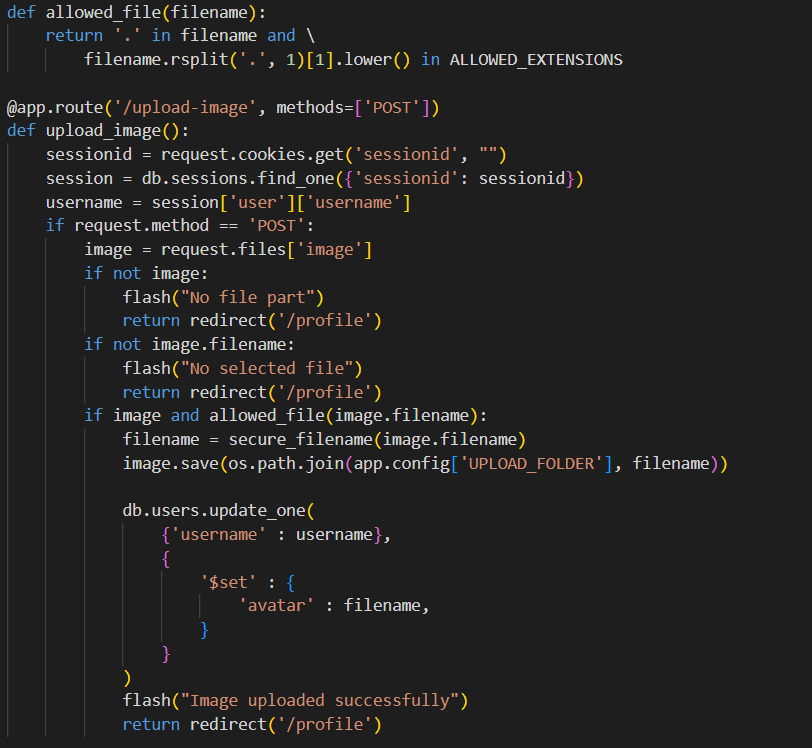
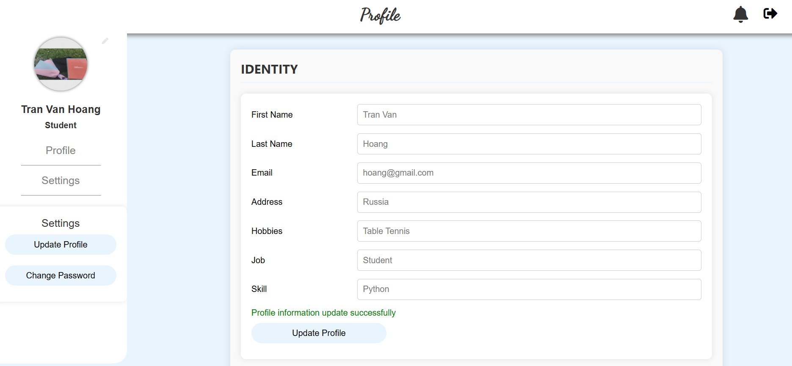
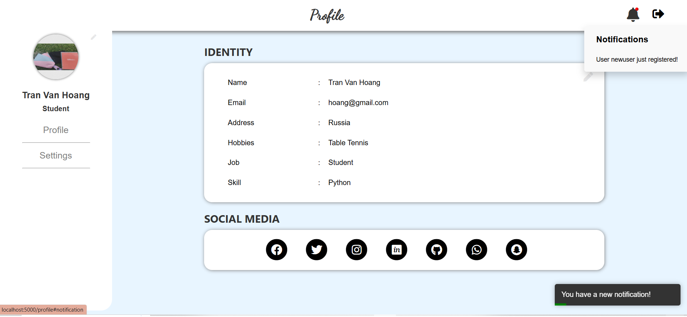

# Flask Real-Time Notification System

This project is a web application built with Flask that implements a real-time notification system using Socket.IO. The application allows users to sign up, log in, and receive notifications when new users register.

## Features

### Basic Features

1. **Implement Authentication Feature:**
   - **Listen on localhost:5000:** The Flask application listens on port 5000, serving as the entry point for users.
   - **Render Authentication Form:** The login form is rendered at `http://localhost:5000/`, allowing users to enter their credentials.
   <div align="center">
       
   </div>

   - **Redirect to Profile Page:** Upon successful authentication, users are redirected to their profile page.
   - **Profile Page for Authenticated Users:** The profile page at `http://localhost:5000/profile` is accessible only to authenticated users.
   <div align="center">
       
   </div>

   - **User Data Storage:** Usernames and passwords are stored securely in MongoDB.
   <div align="center">
       
   </div>

### Advanced Features (Optional)

1. **Account and Profile Management:**
   - **Create New Account:** Users can create new accounts (`http://localhost:5000/signup`), and each account has its own profile data.
   <div align="center">
       
   </div>

   - **Password Hashing and Change Password:** User's password are hashed using Flask-Bcrypt to ensure security and they can change their passwords through the profile settings.
   <div align="center">
       
   </div>

   - **Logout:** Users can log out. When a user logs out, the user's session information is deleted from the browser.
   <div align="center">
       
   </div>

   - **Profile Picture Update:** Users can upload a new profile picture, with a default image set for new users.
   <div align="center">
       
   </div>
   
   - **Profile Information Update:** Users can update their personal information, such as name, email, and address.
   <div align="center">
       
   </div>

### Challenging Features (Optional)

1. **Real-Time Notifications:**
   - **New Account Notification:** Active users receive real-time notifications when a new account is created. This is implemented using Socket.IO, which broadcasts a `notify_new_user` event to all connected clients.
   - **Toast Notifications:** Notifications are displayed as toast messages, providing a visual alert to users.
   <div align="center">
       
   </div>

## Technologies Used

- **Flask:** A lightweight WSGI web application framework.
- **Flask-SocketIO:** Enables real-time communication between the client and server.
- **MongoDB:** A NoSQL database for storing user data and sessions.
- **Flask-Bcrypt:** For hashing passwords securely.
- **HTML/CSS:** For the frontend interface.
- **JavaScript:** For client-side scripting and real-time updates.

## Setup Instructions

### Prerequisites

- Python 3.x
- MongoDB
- Node.js and npm (for Socket.IO)

### Installation

1. **Clone the repository:**

   ```bash
   git clone https://github.com/itmo-wad/TranVanHoang-HW2
   cd your-repo-name
   ```

2. **Create a virtual environment:**

   ```bash
   python -m venv venv
   source venv/bin/activate  # On Windows use `venv\Scripts\activate`
   ```

3. **Install the dependencies:**

   ```bash
   pip install -r requirements.txt
   ```

4. **Run MongoDB:**

   Ensure MongoDB is running on your local machine. You can start it using:

   ```bash
   mongod
   ```

5. **Start the Flask application:**

   ```bash
   flask run
   ```

   Or if using Socket.IO:

   ```bash
   python app.py
   ```

6. **Access the application:**

   Open your web browser and go to `http://localhost:5000`.

## Usage

- **Sign Up:** Create a new account by providing a username and password.
- **Log In and Log Out:** Access your profile by logging in with your credentials and log out.
- **Profile Management:** Update your profile information and upload an avatar.
- **Password Management:** Hashed password and change your password.
- **Real-Time Notifications:** Receive notifications when new users register while you are online.

## Contributing

Contributions are welcome! Please fork the repository and submit a pull request for any improvements or bug fixes.

## Acknowledgments

- [Flask Documentation](https://flask.palletsprojects.com/)
- [Socket.IO Documentation](https://socket.io/docs/)
- [MongoDB Documentation](https://docs.mongodb.com/)